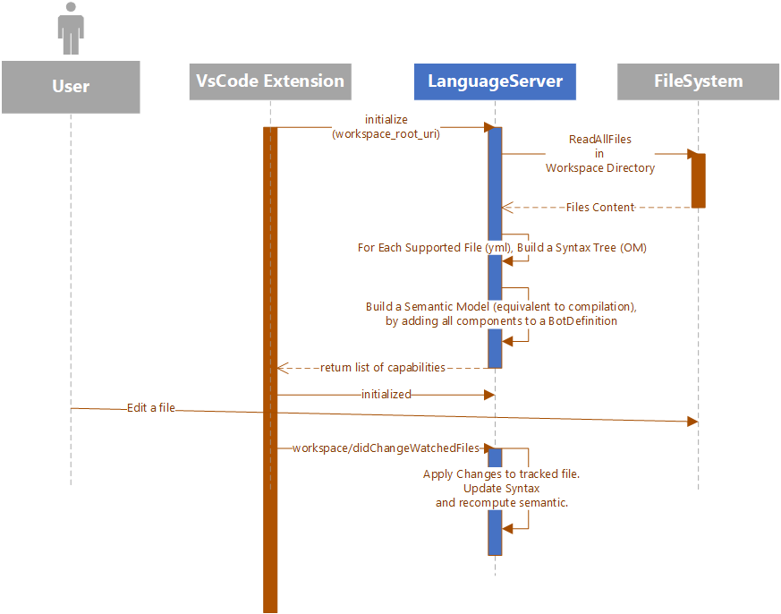

[[_TOC_]]

# MCS Language Server Capabilities

Here are information about some LSP features that are currently supported and some notes and disclaimer on ongoing and future work.

# Sample Sequence

This diagram shows what happen when a user opens a **directory** with MCS extension enabled.

All the communications between VsCode Extension and the Language Server are done through **LSP methods**:
1. [**"initialize"**](#initialize)
2. [**"initialized"**](#initialized)
3. [**"workspace/didChangeWatchedFiles"**](#workspace_didChangeWatchedFiles)

# LSP Methods

Here are information about the supported LSP methods.
For all LSP specifications, we are following: https://microsoft.github.io/language-server-protocol/specifications/lsp/3.17/specification/

## initialize

Specs and parameters: https://microsoft.github.io/language-server-protocol/specifications/lsp/3.17/specification/#initialize

Summary:
1. Request intialization with parameter: working directory/workspace root.
1. Read all files within the workspace and build semantic tree in the background, using ObjectModel API.
1. Return server capabilities to client.

See [sample sequence](#sample_sequence) for an example.

## initialized

Specs: https://microsoft.github.io/language-server-protocol/specifications/lsp/3.17/specification/#initialized
Supported method but No-Op.

See [sample sequence](#sample_sequence) for an example.

## textDocument/didOpen

Specs: https://microsoft.github.io/language-server-protocol/specifications/lsp/3.17/specification/#textDocument_didOpen

Summary:
1. The document’s content is now managed by the client and the server must not try to read the document’s content using the document’s Uri.
1. In the future, the server may try to refresh documents' content using documents' Uri to make sure content is up to date. As of February 2025, we only read from the files once, on initialize.
1. Send diagnostics for the file.

## textDocument/didChange

Specs: https://microsoft.github.io/language-server-protocol/specifications/lsp/3.17/specification/#textDocument_didChange

Summary:
1. Similar to [didChangeWatchedFiles](#workspace_didChangeWatchedFiles) but also trigger diagnostic on the file.
1. Requires the client to take ownership of the file through "didOpen". That is why diagnostics are sent for th file.
1. Do not assume that the file is saved so it ignores diagnostics for any other file, unlike [didSave](textDocument_didSave).

## textDocument/publishDiagnostics

Specs: https://microsoft.github.io/language-server-protocol/specifications/lsp/3.17/specification/#textDocument_publishDiagnostics

Summary:
1. MCS "Language" has a "project semantic" (bot definition) hence diagnostics are cached. 

## textDocument/didSave

Specs: https://microsoft.github.io/language-server-protocol/specifications/lsp/3.17/specification/#textDocument_didSave

Summary: Not Yet Supported.

## workspace/didChangeWatchedFiles

Specs: https://microsoft.github.io/language-server-protocol/specifications/lsp/3.17/specification/#workspace_didChangeWatchedFiles
Summary:
1. The user changed a file directly on the file system, without going through vscode. (see [textDocument/didChange](#textDocument_didChange) for interaction in vscode)
1. The fileSystem watcher within the extension still catches the change and notify the server.
1. In this case, no diagnostic is emitted to reflect the change.

See [sample sequence](#sample_sequence) for an example.
